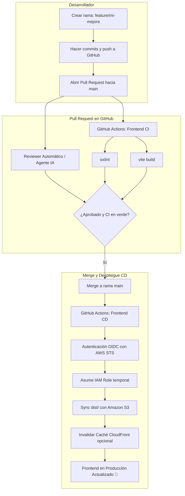

# 🚀 Guía de Arquitectura CI/CD Frontend con GitHub Actions y AWS OIDC

Esta guía detalla el flujo profesional de integración y despliegue continuo (CI/CD) para el frontend de la plataforma, garantizando que:
1. **Ningún cambio llegue a producción sin pasar por un Pull Request (PR)**.
2. **GitHub Actions valide y compile el frontend** en cada PR antes del merge.
3. **Un Reviewer automático o Agente IA** analice el código y proporcione feedback.
4. **AWS OIDC (OpenID Connect)** permita a GitHub Actions desplegar a S3 sin almacenar credenciales de AWS permanentes (`AWS_ACCESS_KEY_ID` / `AWS_SECRET_ACCESS_KEY`).

---

## 🏗 Arquitectura del Flujo



---

## 📋 Pasos para la Configuración

### Paso 1: Configurar AWS con OIDC (Elige Opción A o B)

#### Opción A: Despliegue Rápido con CloudFormation (Recomendado)
Usa la plantilla ubicada en [`aws/frontend-oidc-s3-setup.yml`](file:///c:/Users/Pandora/Desktop/API-con-EC2/aws/frontend-oidc-s3-setup.yml):

1. Abre la consola de **AWS CloudFormation** en la región deseada (ej. `us-east-1`).
2. Haz clic en **Create stack** -> **With new resources (standard)**.
3. Selecciona **Upload a template file** y sube [`aws/frontend-oidc-s3-setup.yml`](file:///c:/Users/Pandora/Desktop/API-con-EC2/aws/frontend-oidc-s3-setup.yml).
4. Parámetros del stack:
   - `GitHubOrgOrUser`: `LeirBaGMC`
   - `GitHubRepoName`: `API-con-EC2`
   - `S3BucketName`: nombre único para tu bucket (ej. `api-ec2-frontend-prod-2026`)
5. Marca la casilla de confirmación de creación de capacidades IAM y haz clic en **Submit**.
6. En la pestaña **Outputs** del stack terminado, copia:
   - `RoleArnToAssume` (ej. `arn:aws:iam::123456789012:role/API-con-EC2-GitHubActions-FrontendRole`)
   - `S3BucketNameOutput`
   - `S3BucketWebsiteURL`

---

#### Opción B: Configuración Manual en AWS Console / CLI

1. **Crear el Proveedor de Identidad OIDC en IAM**:
   - Tipo de proveedor: **OpenID Connect**.
   - URL del proveedor: `https://token.actions.githubusercontent.com`
   - Audiencia (Client ID): `sts.amazonaws.com`
2. **Crear el Rol IAM (`GitHubActionsFrontendRole`)**:
   - En *Trusted entity type* selecciona **Web identity**.
   - Selecciona el proveedor `token.actions.githubusercontent.com` y audiencia `sts.amazonaws.com`.
   - Edita la política de confianza con [`aws/trust-policy.json`](file:///c:/Users/Pandora/Desktop/API-con-EC2/aws/trust-policy.json).
3. **Adjuntar Política de Permisos S3 al Rol**:
   - Crea una política inline o gestionada usando [`aws/s3-policy.json`](file:///c:/Users/Pandora/Desktop/API-con-EC2/aws/s3-policy.json), reemplazando el nombre del bucket de tu frontend.
4. **Habilitar Static Website Hosting en tu Bucket S3**:
   - Activar Website Hosting: Index document = `index.html`, Error document = `index.html`.

---

### Paso 2: Configurar Variables y Secretos en GitHub

En tu repositorio de GitHub ([https://github.com/LeirBaGMC/API-con-EC2](https://github.com/LeirBaGMC/API-con-EC2)):
Ve a **Settings** -> **Secrets and variables** -> **Actions**.

#### 1. Repository Secrets (`New repository secret`):
- `AWS_ROLE_ARN`: El ARN del rol IAM (ej. `arn:aws:iam::123456789012:role/API-con-EC2-GitHubActions-FrontendRole`).
- `VITE_YOUTUBE_API_KEY`: *(Opcional)* Clave de la API de YouTube si no se inyecta por entorno.

#### 2. Repository Variables (`Variables` -> `New repository variable`):
- `AWS_REGION`: `us-east-1` (o tu región de AWS).
- `S3_BUCKET_NAME`: Nombre del bucket S3 del frontend.
- `VITE_API_URL`: URL base de tu API Backend (ej. `http://tu-ec2-o-dominio.com` o la IP pública de tu backend).
- `CLOUDFRONT_DISTRIBUTION_ID`: *(Opcional)* Si usas CloudFront como CDN frente a S3.

---

### Paso 3: Proteger la Rama `main` (Branch Protection Rules)

Para obligar a que todo cambio pase por PR y CI:
1. En GitHub, ve a **Settings** -> **Branches**.
2. Haz clic en **Add branch ruleset** (o **Add branch protection rule**).
3. Branch name pattern: `main`.
4. Activa:
   - ✅ **Require a pull request before merging** (Requerir aprobaciones de revisión).
   - ✅ **Require status checks to pass before merging**:
     - Busca y selecciona: `validate-and-build` (o `Lint & Compile Frontend`).
   - ✅ **Do not allow bypassing the above settings**.
   - ✅ **Block force pushes**.
5. Guarda los cambios.

---

### Paso 4: Activar el Agente Reviewer Automático

Tienes a tu disposición:
1. **CodeRabbit AI Reviewer**:
   - Se incluye el archivo [`.coderabbit.yaml`](file:///c:/Users/Pandora/Desktop/API-con-EC2/.coderabbit.yaml).
   - Instálalo gratis para proyectos públicos/personales en: [GitHub Marketplace - CodeRabbit](https://github.com/marketplace/coderabbitai).
   - En cada PR nuevo, el agente de CodeRabbit dejará un resumen ejecutivo, diagrama de cambios, y comentarios línea por línea evaluando seguridad, rendimiento y buenas prácticas.
2. **Qodo PR-Agent / Codium**:
   - Alternativa disponible en [GitHub Marketplace - Qodo PR-Agent](https://github.com/marketplace/pr-agent).

---

## 💻 Flujo de Trabajo Diario para el Desarrollador

1. **Crear una rama para la mejora**:
   ```bash
   git checkout -b feature/mejora-interfaz
   ```
2. **Hacer cambios y comprobar localmente**:
   ```bash
   npm --prefix frontend run lint
   npm --prefix frontend run build
   ```
3. **Subir los cambios a GitHub**:
   ```bash
   git add .
   git commit -m "feat: agregada nueva mejora al reproductor"
   git push origin feature/mejora-interfaz
   ```
4. **Abrir Pull Request**:
   - Al entrar a GitHub, aparecerá la sugerencia de abrir PR hacia `main`.
   - Se cargará automáticamente la plantilla de PR ([`.github/pull_request_template.md`](file:///c:/Users/Pandora/Desktop/API-con-EC2/.github/pull_request_template.md)).
   - El workflow `frontend-ci.yml` se disparará de inmediato para verificar que el frontend compile sin errores.
   - El agente revisor inspeccionará el código y dejará comentarios.
5. **Aprobación y Merge**:
   - Una vez revisado y con el check verde de CI, se hace clic en **Merge Pull Request**.
   - El workflow `frontend-cd.yml` se disparará automáticamente en `main`.
   - Se autenticará con AWS vía OIDC y sincronizará el nuevo bundle compilado en S3.
